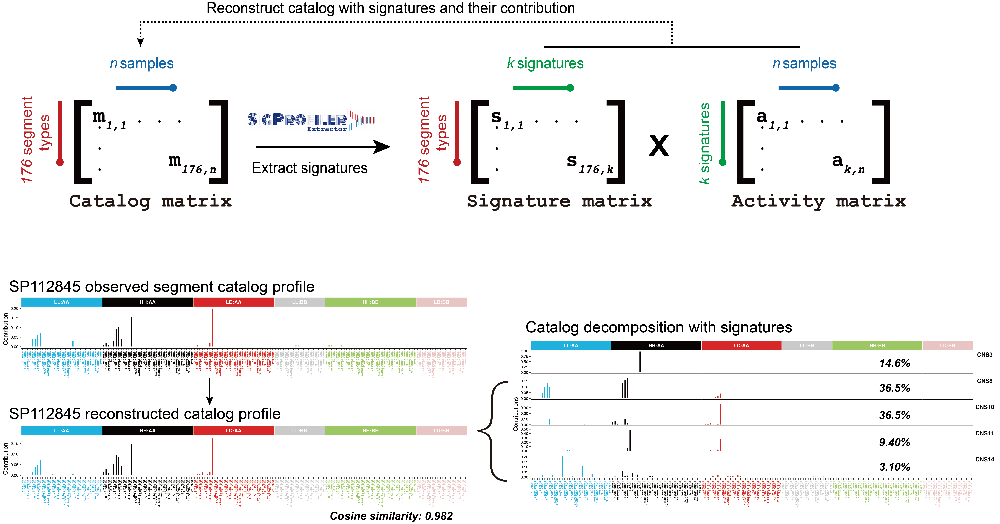
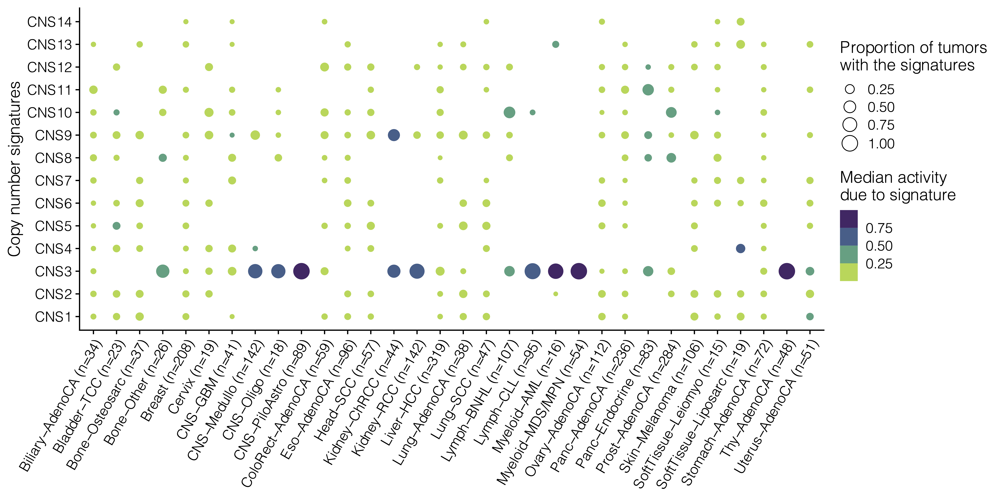
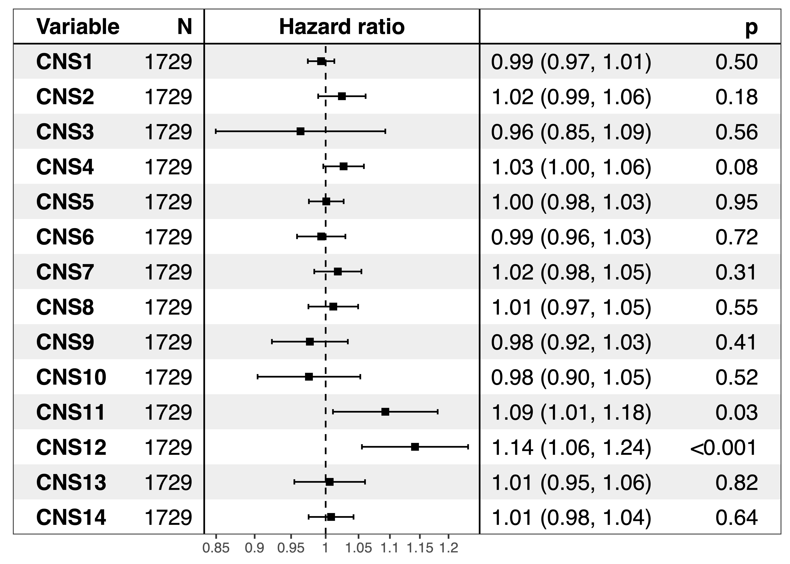

```{r, include=FALSE}
knitr::opts_chunk$set(echo = FALSE,
                      warning = FALSE,
                      tidy = FALSE,
                      message = FALSE,
                      fig.align = 'center',
                      out.width = "100%")
options(knitr.table.format = "html") 
```

# Abstract

DNA alteration signatures are recurring patterns that are the imprints of mutagenic processes accumulated during the evolution of cancer cell. Despite the importance of copy number alteration (CNA) in cancer progression,comprehensive understanding about the mutational processes and signatures of CNA is still lacking. Here we developed a method to categorize CNA based on various fragment properties, which reflect the consequences of mutagenic processes and can be extracted from different types of data, including whole genome sequencing (WGS), whole exome sequencing (WES) and SNP array. The signature of CNA has been extracted from 2778 pan-cancer analysis of whole genomes (PCAWG) WGS samples, and further validated using 10851 the cancer genome atlas (TCGA) SNP array dataset. Novel copy number signatures associated with haploid chromosome have been identified. The activities of some copy number signatures consistently predict cancer patients’ prognosis. This study provides a repertoire for understanding the signatures and mutational processes of CNA.


# Methodology 


```{r, figure1, fig.cap='CNA classification strategy for signature analysis.', out.width="80%"}
knitr::include_graphics("Figures/copy number classification.png")
```

For each CNA segment, the following features have been considered: 1, segment context, including segment shape and copy number change number; 2, Absolute copy number; 3, LOH status; 4, segment size. In total 176 types of CNA segments have been defined accordingly. 

```{r, figure2, fig.cap='De novo CNA signature extraction with sigprofiler.', out.width="80%"}

```
We selected the signature extraction solution as the maximum signature number which meets the following criteria:
1.	No over fit.
2.	Stability should be at least local maximal.
3.	Mean cosine distance should be as small as possible.
Based on the rules, we selected 14 signatures for PCAWG copy number data.

# Results

```{r, figure3, fig.cap='Proportion of tumors with the signature and the median activity of the signature are shown for 32 PCAWG cancer types. For each individual tumor, only signatures that contribute to ≥5% of the total are counted.',out.width="70%"}

```

```{r, figure4, fig.cap='Representative CNA profile, prominent features and potential mechanisms for each identified CNA signatures extracted in PCAWG dataset.'}
knitr::include_graphics("Figures/CNS-Profile.png")
```

An important purpose of CNA signature analysis is to identify the underlying mutational processes for CNA, and classify CNA based on mutational processes. Potential mutational processes for CNA include intrinsic inducers and extrinsic inducers. Intrinsic CNA inducers include: double-strand break repair defect (HRD etc.); cell cycle defect; DNA replication defects; telomere loss, etc. 

```{r, figure5, fig.cap='CNA signature activity and cancer patients’ prognosis.',out.width="80%"}

```

The CNA signatures extracted from cancer patients could be cancer prognosis biomarkers.In pan-cancer level, activities of CNS11, CNS12 are significantly associated with poor OS.


# Conclusion

- We developed a unified and comprehensive method for copy number signature analysis. 
- Our method can be applied in cancer patients with copy number profiles generated with WGS, WES or SNP array data. - Our copy number signature analysis method is based on a novel and comprehensive method to catalog copy number segments.
- copy number signatures could be biomarkers to guide cancer precision medicine. 

# More
You can scan QR code at bottom center to see online analysis report. All code and related data are published at https://github.com/XSLiuLab/Pan-cancer_CNA_signature.

# Acknowledgments

We thank ShanghaiTech University High Performance Computing Public Service Platform for computing services. This work was supported by The National Natural Science Foundation of China (31771373), Shanghai Science and Technology Commission (21ZR1442400), and startup funding from ShanghaiTech University. 

# Recent works of out lab

- Wang, Shixiang, et al. "Copy number signature analysis tool and its application in prostate cancer reveals distinct mutational processes and clinical outcomes." PLoS genetics 17.5 (2021): e1009557.
- Wang, Shixiang, et al. "UCSCXenaShiny: an R/CRAN package for interactive analysis of UCSC xena data." Bioinformatics (2021).
- Wang, Shixiang, et al. "Sigflow: an automated and comprehensive pipeline for cancer genome mutational signature analysis." Bioinformatics 37.11 (2021): 1590-1592.

[©Cancer Biology Group](https://github.com/XSLiuLab/) 2021

<small>Research group led by Xue-Song Liu in ShanghaiTech. University. Lab website is shown in QR code at bottom right.</small>

